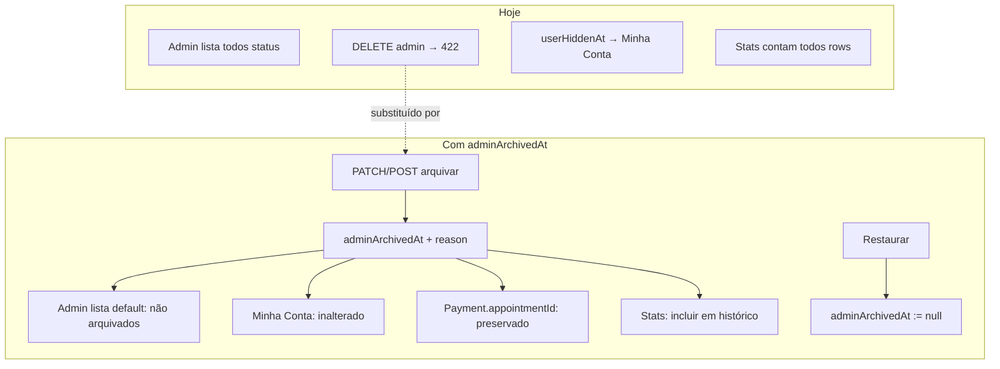

# Auditoria — Appointment Archive (`adminArchivedAt` / `adminArchivedReason`)

Documentação de auditoria **somente leitura** sobre o impacto de introduzir arquivamento administrativo soft na entidade `Appointment`.

**Data:** 2026-06-23  
**Escopo:** Schema, APIs admin/operacionais, Minha Conta, domínio financeiro, Guardian, estatísticas  
**Estado atual:** `DELETE /api/admin/agendamentos` retorna **HTTP 422** (“Arquivamento ainda não implementado”). `purgeCancelledOrRefusedAppointment` e `appointmentCanAdminPurge` existem em `lib/` mas **não são chamados** por nenhuma rota.

---

## Diagrama — visão do arquivamento



---

## 1. Schema — Appointment

### 1.1 Campos existentes relacionados

| Campo | Tipo | Papel semântico |
|-------|------|-----------------|
| `status` | string | Ciclo operacional: `pendente` → `aceito`/`recusado` → `em_andamento` → `concluido` / `cancelado` |
| `blocked` / `blockedAt` / `blockedReason` | bool + timestamps | Bloqueio administrativo via PATCH; distinto de cancelamento |
| `cancelReason` / `cancelledAt` | string + DateTime | Cancelamento (admin ou usuário) |
| `cancelRefundOption` | `reembolso` \| `cupom` | Escolha pós-cancelamento na Minha Conta |
| `refundProcessedAt` / `refundAsaasStatus` / `refundUserConfirmedAt` / `refundUserDisputedAt` | timestamps + string | Trilha de reembolso direto |
| `refundCouponId` | string? (sem FK) | Ponte para cupom de remarcação (**X2**) |
| `userHiddenAt` | DateTime? | Ocultação **somente Minha Conta**; admin mantém visível (**A7**) |
| `readAt` | DateTime? | Confirmação visual pelo usuário |

**Campos propostos:**

| Campo | Papel esperado |
|-------|----------------|
| `adminArchivedAt` | Soft-delete administrativo; registro permanece no banco |
| `adminArchivedReason` | Justificativa auditável (paralelo a `adminInactiveReason` em `UserPlan`) |

### 1.2 Conflitos semânticos

| Par | Risco |
|-----|-------|
| `adminArchivedAt` vs `userHiddenAt` | Dois eixos de visibilidade (admin vs usuário). Devem ser **ortogonais** — espelhar padrão `UserPlan.userHiddenAt` + `UserPlan.adminInactiveAt`. |
| `adminArchivedAt` vs `cancelledAt` | Arquivar ≠ cancelar. Arquivar registro já `cancelado`/`recusado`/`concluido` é o caso principal; arquivar `pendente`/`aceito` sem cancelar deixaria slot ocupado. |
| `adminArchivedAt` vs `blocked` | `blocked` é flag operacional legada no PATCH; arquivamento é retirada da fila admin sem apagar. |
| `adminArchivedAt` vs purge | `purgeCancelledOrRefusedAppointment` apaga Payment + Appointment; arquivamento **não deve** apagar Payment (**F4**, **X4**). |
| `adminArchivedReason` vs `cancelReason` | Motivos distintos: cancelamento (usuário/admin) vs arquivamento (limpeza admin pós-resolução). |

### 1.3 Índices recomendados (análise)

- `@@index([adminArchivedAt])` — filtros admin e Guardian
- Composto opcional: `@@index([status, adminArchivedAt])` — listagens por seção

---

## 2. APIs Admin

### 2.1 Listagem

| Arquivo | Query atual | Impacto de `adminArchivedAt` |
|---------|-------------|------------------------------|
| `src/app/api/admin/agendamentos/route.ts` GET | `findMany` com `status in [pendente…concluido]`; sem filtro de arquivo | **Alto:** adicionar `adminArchivedAt: null` no default; endpoint/query param `?incluirArquivados=true` ou aba “Arquivados” |
| `src/app/admin/agendamentos/page.tsx` | Consome GET acima; seções por `status` | **Alto:** filtrar arquivados da lista principal; badge “Arquivado”; botão Arquivar/Restaurar no lugar de Excluir |
| `src/app/api/admin/servicos/route.ts` GET | `service.findMany` + backfill appointments sem serviço | **Médio:** backfill não deve rodar em arquivados; serviços de appointment arquivado podem permanecer visíveis ou herdar filtro |
| `src/app/api/admin/pagamentos/route.ts` | `appointment.findMany` para enriquecer pagamentos | **Baixo:** manter resolução por ID mesmo se arquivado (histórico financeiro) |
| `src/app/api/admin/cupons/route.ts` | `appointment.findMany` por IDs de cupons | **Baixo:** incluir arquivados na resolução de contexto |
| `src/app/api/admin/usuarios/route.ts` | `appointment.findMany` por `userId` | **Médio:** decidir se perfil admin do usuário mostra arquivados |
| `src/app/api/admin/cupons/corrigir-antigos/route.ts` | `appointment.findMany` por IDs | **Baixo:** não excluir arquivados da correção |

### 2.2 Alteração

| Arquivo | Operação | Impacto |
|---------|----------|---------|
| `src/app/api/admin/agendamentos/route.ts` PATCH | Transições de status, `blocked` | **Alto:** bloquear PATCH de status em arquivados (ou exigir restaurar antes); não limpar `adminArchivedAt` em mudanças de status |
| `src/app/api/admin/agendamentos/cancelar/route.ts` POST | `status → cancelado` | **Médio:** não permitir cancelar se já arquivado (409) ou auto-restaurar — preferir 409 |
| `src/app/api/admin/agendamentos/reverter-cancelamento/route.ts` POST | Reverte para `aceito` | **Alto:** deve recusar se `adminArchivedAt` preenchido |
| `src/app/api/admin/servicos/route.ts` PATCH | Atualiza serviço + sync appointment | **Médio:** sync em appointment arquivado pode reativar operacionalmente — bloquear |
| `src/app/api/admin/servicos/entrega/route.ts` | Conclui entrega | **Médio:** idem |
| `src/app/api/admin/cupons/adicionar-a-conta/route.ts` | `appointment.update` | **Baixo:** validar não-arquivado se appointment vinculado |

### 2.3 Exclusão

| Arquivo | Comportamento atual | Impacto |
|---------|---------------------|---------|
| `src/app/api/admin/agendamentos/route.ts` DELETE | HTTP **422** fixo | **Substituir** por arquivamento (não purge físico por default) |
| `src/app/lib/purge-cancelled-appointment.ts` | Apaga Service, desvincula Coupon, **deleta Payment**, deleta Appointment | **Não usar** como implementação de archive; risco **CRÍTICO** financeiro |
| `src/app/lib/appointment-hidden.ts` `appointmentCanAdminPurge` | Regras de elegibilidade para purge | **Reutilizar lógica** para `appointmentCanAdminArchive` (mesmas pré-condições de resolução) |

### 2.4 Contagem e estatísticas admin

| Arquivo | Query | Impacto recomendado |
|---------|-------|---------------------|
| `src/app/api/admin/stats/route.ts` | `appointment.count()` por status | **Incluir arquivados** nas métricas históricas; expor `appointmentsArquivados` separado |
| `src/app/api/admin/stats/detalhadas/route.ts` | `total`, `ativosWhere: cancelledAt null`, cancelados por `cancelledAt` | **Incluir** arquivados no total; **não** subtrair de histórico; métrica opcional `totalArquivados` |
| `src/app/api/admin/stats/graficos/route.ts` | `secao=agendamentos`: `cancelledAt: null`; `agendamentos-servicos`: idem | Gráficos de **agenda ativa** podem excluir arquivados **e** cancelados; gráfico histórico total **inclui** arquivados |
| `src/app/admin/estatisticas/page.tsx` | UI das stats acima | Exibir série “Arquivados” se métrica separada for adotada |

---

## 3. APIs operacionais

### 3.1 Mapa de fluxos

| Fluxo | Arquivo(s) | Query / regra atual |
|-------|------------|---------------------|
| Disponibilidade pública | `api/agendamentos/disponibilidade/route.ts` | `status in [aceito, confirmado, em_andamento]`, `data >= now` |
| Checkout agendamento | `api/asaas/checkout-agendamento/route.ts` | Conflito: `status not cancelado` |
| Checkout carrinho | `api/asaas/checkout-carrinho/route.ts` | Mesmo padrão de conflito |
| Criação manual | `api/agendamentos/route.ts` POST | Conflito: `status not cancelado` |
| Efeitos pós-pagamento | `lib/asaas-agendamento-payment-effects.ts` | Conflito: `status not cancelado` |
| Reconcile | `lib/asaas-agendamento-reconcile.ts` | Conflito: `status not cancelado` |
| Webhook carrinho | `api/webhooks/asaas/route.ts` | Conflito: `status not cancelado` |
| Cancelamento usuário | `api/agendamentos/cancelar/route.ts` | Não verifica arquivo |
| Reembolso / remarcação | `api/agendamentos/escolher-reembolso/route.ts` | `status in [cancelado, recusado]`; ownership `userId` |
| Com cupom | `api/agendamentos/com-cupom/route.ts` | Cria appointment; conflito implícito |
| Reverter cancelamento admin | `api/admin/agendamentos/reverter-cancelamento/route.ts` | Conflito só com `aceito`/`confirmado` |

### 3.2 Appointment arquivado deve bloquear horário?

**Recomendação: NÃO** (para o caso de uso principal: limpar admin após resolução).

**Justificativa:**

- O caso alvo é `cancelado`/`recusado`/`concluido` já resolvido — esses estados em grande parte **não** ocupam slot na disponibilidade pública (só `aceito`/`confirmado`/`em_andamento`).
- Exceção atual: conflito usa `status <> cancelado`, então **`recusado` ainda bloqueia slot** (**A8** comportamento conhecido). Arquivar não corrige isso sozinho.
- Se admin arquivar `pendente`/`aceito` **sem cancelar**, o registro continuaria bloqueando slot nas queries atuais → **bug**.

**Regra de negócio recomendada:** só permitir arquivar quando `appointmentCanAdminArchive` (derivado de `appointmentCanAdminPurge` + estados terminais) OU excluir arquivados das queries de conflito via `adminArchivedAt: null`.

### 3.3 Deve participar de conflito?

**Recomendação: NÃO** — adicionar `adminArchivedAt: null` em **todas** as queries de conflito listadas acima.

Arquivado = fora do pool operacional de agenda, independente de `status`. Isso corrige edge case de `recusado` bloqueando slot se arquivado após resolução.

### 3.4 Deve aparecer em consultas operacionais?

| Consulta | Recomendação |
|----------|--------------|
| Disponibilidade pública | **Não** |
| Checkout / conflito | **Não** |
| Minha Conta (`meus-dados`) | **Sim** (inalterado — ver §4) |
| Admin lista operacional | **Não** (default); sim em “Arquivados” |
| Reembolso / escolher opção | **Sim** — usuário ainda precisa interagir antes de resolver |
| Guardian / auditoria | **Sim** — registro existe |

---

## 4. Minha Conta

### 4.1 Componentes analisados

| Peça | Arquivo | Comportamento |
|------|---------|---------------|
| Listagem | `api/meus-dados/route.ts` | `findVisibleAppointments` → filtra `userHiddenAt` |
| Ocultação usuário | `api/agendamentos/excluir/route.ts` DELETE | `hideAppointmentFromAccount` |
| Resolução automática | `appointmentResolvedForUser` em `appointment-hidden.ts` | Remove da lista quando reembolso/cupom resolvido |
| Restauração reembolso | `restoreAppointmentVisibilityPendingRefundConfirmation` | Limpa `userHiddenAt` em casos pendentes |

### 4.2 `adminArchivedAt` deve afetar a Minha Conta?

**Recomendação: NÃO.**

**Justificativa (paralelo **A7**):**

- `userHiddenAt` é eixo **usuário**; `adminArchivedAt` é eixo **admin**.
- Usuário com cancelamento pendente de escolha (reembolso/cupom) **deve** continuar vendo o agendamento em Minha Conta mesmo que admin arquive na sua fila — senão quebra `escolher-reembolso`.
- `appointmentResolvedForUser` já remove da conta após resolução; arquivamento admin seria **após** esse momento (mesmas regras que `appointmentPodeExcluirAdmin` na UI).
- Nenhuma alteração necessária em `findVisibleAppointments` / `filterVisibleAppointmentList` **desde que** archive só seja permitido quando resolvido.

**Exceção documentada:** se no futuro admin puder arquivar antes da resolução do usuário, Minha Conta **ainda** deve mostrar (não filtrar por `adminArchivedAt`).

---

## 5. Financeiro

### 5.1 Entidades impactadas

| Entidade | Vínculo com Appointment | Efeito do archive (soft) |
|----------|-------------------------|---------------------------|
| `Payment` | `appointmentId`, `appointmentIds` JSON — **sem FK** | Row preservado → **F4 não dispara** por delete |
| `Coupon` | `appointmentId`, `paymentId` | Preservado; consumo/remarcação intactos |
| `UserPlan` | Indireto via cupom de plano | Sem impacto direto |
| `refundCouponId` | Ponte lógica (**X2**) | Preservado se Appointment não deletado |
| `refundProcessedAt` / `refundRequestedAt` | No Appointment | Preservados; trilha de reembolso intacta |

### 5.2 Cenários de quebra

| Cenário | Severidade | Condição |
|---------|------------|----------|
| Purge em vez de archive | **CRÍTICO** | Deleta Payment → quebra histórico e **F4** inverso |
| Arquivar antes de resolução + esconder da Minha Conta | **CRÍTICO** | Se implementação filtrar conta por archive |
| Arquivar com `refundCouponId` ativo e cupom ainda não usado | **ALTO** | Cupom deve permanecer em Meus Cupons; origem arquivada no admin OK |
| Reverter cancelamento em arquivado | **ALTO** | Reativa slot sem restaurar explicitamente |
| Admin PATCH status em arquivado | **ALTO** | Pode reintroduzir na fila operacional inconsistente |
| Payment órfão se archive mal documentado como delete | **MÉDIO** | Confusão operacional, não técnica se row existe |

**Reembolso / remarcação / histórico:** seguros **se** archive = apenas `adminArchivedAt` + reason, sem purge e sem filtrar Minha Conta.

---

## 6. Domain Guardian

### 6.1 Checks existentes — impacto

| Check | Descrição | Precisa mudar? | Recomendação |
|-------|-----------|----------------|--------------|
| **F4** | Payment approved sem Appointment existente | **Não** (archive mantém row) | Se purge for mantido como caminho separado, F4 continua válido |
| **A5** | Appointment ativo sem Service | **Sim (filtro)** | Excluir `adminArchivedAt IS NOT NULL` do scan — arquivados não são fila operacional |
| **A8** | Conflito horário `status <> cancelado` | **Sim** | Excluir arquivados **OU** documentar que archive só em terminais; preferir filtro `adminArchivedAt IS NULL` |
| **X1** | Ownership Payment/Appointment/Coupon | **Não** | Row preservado |
| **X2** | `refundCouponId` tríade | **Não** | Row preservado; purge é que quebraria |

### 6.2 Nova check recomendada

**A9 — Archive inconsistente** (nova, **REVIEW** / WARN):

| Regra | Severidade |
|-------|------------|
| `adminArchivedAt` preenchido e `status in (pendente, aceito, confirmado, em_andamento)` | WARN |
| `adminArchivedAt` preenchido e cancelamento não resolvido (`appointmentCanAdminPurge` false) | ERROR |
| `adminArchivedAt` preenchido sem `adminArchivedReason` (min 3 chars) | WARN |

Atualizar `docs/ai/domain-invariants.md` com **A9** e estender **A7** (“`adminArchivedAt` não altera Minha Conta nem Payment”).

---

## 7. Stats — política recomendada

| Métrica | Arquivados entram? | Métrica separada? | Justificativa |
|---------|-------------------|-------------------|---------------|
| `admin/stats` totais por status | **Sim** | **Sim** (`appointmentsArquivados`) | Histórico financeiro/operacional preservado (**X4**) |
| `detalhadas` total / cancelados | **Sim** no total | Opcional | `cancelledAt` e archive são ortogonais |
| `graficos` agenda ativa (`cancelledAt: null`) | **Não** | — | Arquivado não é agenda futura |
| `graficos` histórico / serviços | **Sim** | — | Reflete produção real |
| Dashboard admin agendamentos (seções) | **Não** na lista default | Aba Arquivados | Foco operacional |

---

## 8. Restauração — arquivos afetados (sem implementar)

### 8.1 Arquivar

| Camada | Arquivos |
|--------|----------|
| Schema | `prisma/schema.prisma` |
| Regras | `src/app/lib/appointment-hidden.ts` (novo `appointmentCanAdminArchive`, `archiveAppointment`, validações) |
| API | `src/app/api/admin/agendamentos/route.ts` (DELETE → archive ou POST `.../arquivar`) |
| UI | `src/app/admin/agendamentos/page.tsx` (`excluirAgendamento` → `arquivarAgendamento`) |
| Conflitos | `checkout-agendamento`, `checkout-carrinho`, `agendamentos/route.ts`, `asaas-agendamento-payment-effects.ts`, `asaas-agendamento-reconcile.ts`, `webhooks/asaas/route.ts` |
| Docs | `docs/ai/domain-invariants.md` |

### 8.2 Restaurar

| Camada | Arquivos |
|--------|----------|
| API | `src/app/api/admin/agendamentos/route.ts` ou `.../restaurar/route.ts` |
| Regras | `appointment-hidden.ts` — `restoreArchivedAppointment` (limpa `adminArchivedAt`, `adminArchivedReason`) |
| UI | `src/app/admin/agendamentos/page.tsx` — ação na aba Arquivados |
| Admin PATCH | Bloqueio removido após restaurar |

---

## 9. Riscos classificados

### CRÍTICO

1. Implementar archive chamando `purgeCancelledOrRefusedAppointment` (deleta Payment).
2. Filtrar `adminArchivedAt` em `meus-dados` / bloquear `escolher-reembolso` para arquivados não resolvidos.
3. Permitir arquivar `pendente`/`aceito` sem liberar slot nem cancelar.

### ALTO

4. Esquecer filtro `adminArchivedAt: null` em uma das 6+ queries de conflito → slot fantasma ou dupla reserva.
5. PATCH admin alterando status de arquivado sem restaurar.
6. `reverter-cancelamento` em appointment arquivado.
7. Backfill de Service em `admin/servicos` GET recriando serviços para arquivados.

### MÉDIO

8. Stats admin inconsistentes (subtrair arquivados do total sem documentar).
9. UI admin ainda mostra “Excluir” com mensagem 422 confusa.
10. `blocked` + `adminArchivedAt` simultâneos sem precedência documentada.
11. Guardian A8 falso positivo em par arquivado + ativo no mesmo slot.

### BAIXO

12. Falta de índice em `adminArchivedAt` em volume alto.
13. `admin/usuarios` mostrando contagem inflada sem separar arquivados.
14. Campos não expostos no Prisma Client até `db push` / generate.

---

## 10. Plano de implementação em fases

### Fase 1 — Migration

| Item | Detalhe |
|------|---------|
| **Arquivos** | `prisma/schema.prisma`, SQL opcional `prisma/migrations/...` |
| **Mudança** | `adminArchivedAt DateTime?`, `adminArchivedReason String?`, índice |
| **Risco** | Baixo se nullable |
| **Dependências** | Nenhuma |

### Fase 2 — Backend

| Item | Detalhe |
|------|---------|
| **Arquivos** | `appointment-hidden.ts`, `admin/agendamentos/route.ts`, queries de conflito (6 arquivos), `admin/agendamentos/reverter-cancelamento`, `admin/agendamentos/cancelar`, `admin/servicos/route.ts` |
| **Mudança** | `appointmentCanAdminArchive`, arquivar/restaurar, DELETE→archive, filtros conflito |
| **Risco** | **Alto** (conflito de slot) |
| **Dependências** | Fase 1 |

### Fase 3 — Admin UI

| Item | Detalhe |
|------|---------|
| **Arquivos** | `admin/agendamentos/page.tsx` |
| **Mudança** | Arquivar/Restaurar, aba Arquivados, remover copy de “excluir irreversível” |
| **Risco** | Médio (UX) |
| **Dependências** | Fase 2 |

### Fase 4 — Guardian

| Item | Detalhe |
|------|---------|
| **Arquivos** | `scripts/domain-guardian-audit.ts`, `domain-guardian-advisor.ts`, `domain-invariants.md`, `domain-architecture-planner.ts` |
| **Mudança** | Filtros A5/A8; nova A9 |
| **Risco** | Baixo |
| **Dependências** | Fase 2 |

### Fase 5 — Validação

| Item | Detalhe |
|------|---------|
| **Cenários** | Arquivar cancelado resolvido; restaurar; conflito slot; meus-dados visível; escolher-reembolso; stats; F4/X2 scan |
| **Arquivos** | Testes manuais + `node --experimental-strip-types scripts/domain-guardian-runner.ts` |
| **Risco** | — |
| **Dependências** | Fases 1–4 |

---

## Relatório final

### 1. Arquivos impactados (28)

**Schema:** `prisma/schema.prisma`

**Lib:** `appointment-hidden.ts`, `purge-cancelled-appointment.ts` (não usar para archive), `asaas-agendamento-payment-effects.ts`, `asaas-agendamento-reconcile.ts`, `coupon-stale-appointment.ts`

**API admin:** `admin/agendamentos/route.ts`, `admin/agendamentos/cancelar/route.ts`, `admin/agendamentos/reverter-cancelamento/route.ts`, `admin/servicos/route.ts`, `admin/servicos/entrega/route.ts`, `admin/stats/route.ts`, `admin/stats/detalhadas/route.ts`, `admin/stats/graficos/route.ts`, `admin/pagamentos/route.ts`, `admin/usuarios/route.ts`, `admin/cupons/route.ts`

**API operacional:** `agendamentos/disponibilidade/route.ts`, `agendamentos/route.ts`, `asaas/checkout-agendamento/route.ts`, `asaas/checkout-carrinho/route.ts`, `webhooks/asaas/route.ts`, `agendamentos/escolher-reembolso/route.ts`, `agendamentos/excluir/route.ts`, `meus-dados/route.ts` (somente validação — sem filtro archive)

**UI:** `admin/agendamentos/page.tsx`, `admin/estatisticas/page.tsx`

**Guardian/docs:** `scripts/domain-guardian-audit.ts`, `domain-guardian-advisor.ts`, `docs/ai/domain-invariants.md`

### 2. Queries impactadas

Todas as `appointment.findFirst` / `findMany` de **conflito de horário** (6 locais) devem ganhar `adminArchivedAt: null`.

Listagens admin operacionais: `admin/agendamentos` GET.

Backfill: `admin/servicos` GET `appointmentsSemServicos`.

Stats: opcional filtro em gráficos de agenda ativa; contador separado em `admin/stats`.

### 3. APIs impactadas

| Método | Rota | Mudança |
|--------|------|---------|
| DELETE | `/api/admin/agendamentos` | Archive em vez de 422 |
| POST/PATCH | nova `/api/admin/agendamentos/restaurar` ou PATCH | Restaurar |
| GET | `/api/admin/agendamentos` | Filtro default |
| PATCH | `/api/admin/agendamentos` | Bloqueio se arquivado |
| POST | `/api/admin/agendamentos/reverter-cancelamento` | Recusar se arquivado |
| GET | stats/* | Métrica arquivados (opcional) |

APIs operacionais de conflito: filtro interno apenas (sem mudança de contrato HTTP).

### 4. Checks impactadas

| Check | Ação |
|-------|------|
| A5 | Excluir arquivados do scan |
| A8 | Excluir arquivados do scan |
| F4 | Sem mudança |
| X1 | Sem mudança |
| X2 | Sem mudança |
| **A9** (nova) | Archive em estado inválido |

### 5. Riscos (resumo)

Críticos: purge vs archive; Minha Conta bloqueada; archive de ativos sem liberar slot.  
Altos: queries de conflito incompletas; mutações admin em arquivados.  
Médios/Baixos: stats, UX, índices.

### 6. Estratégia recomendada

1. **Soft archive only** — nunca deletar Appointment/Payment no fluxo admin padrão.
2. **Ortogonalidade** — `adminArchivedAt` ≠ `userHiddenAt` (admin vs usuário).
3. **Elegibilidade** — reutilizar lógica de `appointmentCanAdminPurge` / `appointmentPodeExcluirAdmin` antes de arquivar.
4. **Conflito** — arquivados **fora** do pool de slot (`adminArchivedAt: null` em todas as queries de conflito).
5. **Minha Conta** — **não** filtrar por `adminArchivedAt`.
6. **Stats** — incluir no histórico total; excluir da agenda ativa; métrica separada opcional.
7. **Purge** — manter código morto desativado ou remover em PR futuro; não ligar ao botão Excluir.

### 7. Ordem recomendada de implementação

```
Fase 1 Migration → Fase 2 Backend (regras + conflito + API archive) → Fase 3 Admin UI → Fase 4 Guardian (A5/A8/A9) → Fase 5 Validação
```

Dentro da Fase 2, ordem interna:

1. `appointmentCanAdminArchive` + testes de elegibilidade  
2. Filtros de conflito (antes de expor botão archive)  
3. Endpoints archive/restaurar  
4. Bloqueios em PATCH/reverter-cancelamento  

---

## Referências

- [domain-invariants.md](./domain-invariants.md) — A7, A8, X2, X4
- [payment-lifecycle-audit.md](./payment-lifecycle-audit.md) — F4, purge vs soft delete
- `UserPlan.adminInactiveAt` / `userHiddenAt` — precedente de eixos separados admin/usuário

---

_Auditoria somente leitura — nenhum código, migration ou correção foi aplicada._
