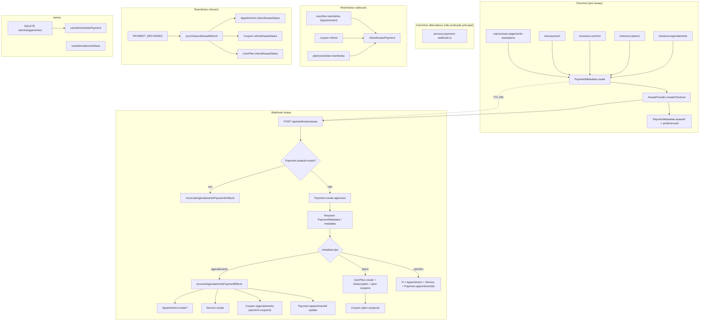

# Auditoria — Ciclo de vida de Payment (THouse)

Documentação de auditoria **somente leitura** do fluxo financeiro completo.

**Data:** 2026-06-23  
**Escopo:** `Payment`, `PaymentMetadata` e artefatos derivados (Appointment, Service, Coupon, UserPlan, Subscription)  
**Fontes:** `prisma/schema.prisma`, código em `src/app/`, `docs/ai/domain-invariants.md`, `docs/ai/domain-risks.md`

---

## 1. Diagrama completo — Payment Lifecycle



### Legenda de tipos de pagamento

| Tipo | Origem checkout | Valor típico | Payment.type pós-webhook |
|------|-----------------|--------------|--------------------------|
| Real agendamento | `checkout-agendamento` | catálogo | `agendamento` |
| Real plano | `checkout` | PLAN_PRICES | `plano` |
| Carrinho | `checkout-carrinho` | soma itens | `agendamento` + `appointmentIds` |
| Simbólico agendamento | `checkout-agendamento` + `symbolicAgendamento` | R$ 5 | `agendamento` |
| Simbólico plano | `reprocessar-pagamento-plano-teste` / teste | R$ 5 | `plano` |
| Cupom-only | metadata sem slot | R$ 5 / simbólico | `agendamento` (sem `appointmentId`) |

---

## 2. Análise por etapa (1–20)

### 2.1 Criação de PaymentMetadata

| Item | Detalhe |
|------|---------|
| **Arquivos** | `src/app/api/asaas/checkout/route.ts`, `checkout-agendamento/route.ts`, `checkout-carrinho/route.ts`, `test-payment/route.ts`, `admin/reprocessar-pagamento-teste/route.ts`, `admin/reprocessar-pagamento-plano-teste/route.ts` |
| **Entradas** | `userId`, payload do checkout (plano/agendamento/carrinho), `expiresAt` (+24h), flags simbólicas opcionais |
| **Saídas** | `PaymentMetadata` com `metadata` JSON, `asaasId` após sucesso do POST Asaas |
| **Dependências** | `User` (auth), `AsaasProvider`, CPF válido |
| **Riscos** | Metadata não criado (catch silencioso em agendamento/carrinho); metadata errado se múltiplos checkouts em 48h |
| **Invariantes** | **M1** (criar antes do Asaas), **M2** (`asaasId` pós-checkout), **M3** (TTL válido no webhook) |
| **Guardian** | S1, S3 (classificação simbólica na metadata) |

### 2.2 Conversão PaymentMetadata → Payment

| Item | Detalhe |
|------|---------|
| **Arquivos** | `src/app/api/webhooks/asaas/route.ts` (principal), `src/app/lib/process-payment-webhook.ts` (alternativo) |
| **Entradas** | `PAYMENT_RECEIVED`, `payment.id` (asaasId), `externalReference` (= userId), resolução de `PaymentMetadata` |
| **Saídas** | `Payment` `status=approved`, `asaasId`, `type` inferido; `PaymentMetadata.asaasId` atualizado |
| **Dependências** | Cadeia de fallback: `asaasId` match → userId recente → 48h → qualquer registro do user |
| **Riscos** | Metadata de outro checkout associado ao pagamento errado; **F4** se efeitos falham após `Payment.create` |
| **Invariantes** | **F1**, **F3**, **M3**, **M4** |
| **Guardian** | F1, F4, S1, S3 |

### 2.3 Webhook Asaas

| Item | Detalhe |
|------|---------|
| **Arquivo** | `src/app/api/webhooks/asaas/route.ts` |
| **Entradas** | Eventos Asaas (`PAYMENT_RECEIVED`, `PAYMENT_REFUNDED`, assinaturas) |
| **Saídas** | Payment + efeitos de domínio; sempre HTTP 200 (idempotência Asaas) |
| **Dependências** | `PaymentMetadata`, `processAgendamentoPaymentEffects`, `plan-coupons`, `asaas-subscriptions` |
| **Riscos** | userId não resolvido → Payment não criado; duplicata tratada com reconcile apenas |
| **Invariantes** | **F1–F8**, **M1–M4**, **P2**, **A1–A5**, **X1**, **X3** |
| **Guardian** | F1, F4, P2, X1 |

### 2.4 process-payment-webhook

| Item | Detalhe |
|------|---------|
| **Arquivo** | `src/app/lib/process-payment-webhook.ts` |
| **Chamado por** | `pagamentos/processar-direto`, `processar-plano-apos-pagamento`, `debug/processar-ultimo-pagamento` |
| **Entradas** | `{ event, payment }` simulando payload Asaas |
| **Saídas** | Payment + **apenas fluxo plano** (UserPlan + cupons); **não** chama `processAgendamentoPaymentEffects` |
| **Dependências** | Mesma resolução de metadata que webhook |
| **Riscos** | **Divergência** com webhook principal para agendamento/carrinho; uso em debug pode mascarar bugs |
| **Invariantes** | **F5**, **P2** (plano); agendamento **não** coberto |
| **Guardian** | F4 (se usado para agendamento sem efeitos) |

### 2.5 checkout-agendamento

| Item | Detalhe |
|------|---------|
| **Arquivo** | `src/app/api/asaas/checkout-agendamento/route.ts` |
| **Entradas** | servicos/beats, data/hora, total, `cupomCode`, `symbolicAgendamento` (admin) |
| **Saídas** | `PaymentMetadata`, URL Asaas (`initPoint`) |
| **Dependências** | Conflito de slot (`status ≠ cancelado`), `symbolic-payment` para R$ 5 |
| **Riscos** | Conflito A8; metadata incompleto sem data/hora (cupom-only) |
| **Invariantes** | **M1**, **A8** |
| **Guardian** | A8, S1, S3 |

### 2.6 checkout-plano

| Item | Detalhe |
|------|---------|
| **Arquivo** | `src/app/api/asaas/checkout/route.ts` |
| **Entradas** | `planId`, `modo`, `paymentMethod`, CPF |
| **Saídas** | `PaymentMetadata` (tipo plano), checkout Asaas |
| **Dependências** | `findActiveUserPlan` (bloqueia 409), `PLAN_PRICES` |
| **Riscos** | Plano não criado no checkout (correto); falha se metadata perdido no webhook |
| **Invariantes** | **M1**, **F5**, **P1**, **P2** |
| **Guardian** | P2, F4 (indireto) |

### 2.7 Carrinho

| Item | Detalhe |
|------|---------|
| **Arquivos** | `checkout-carrinho/route.ts` → webhook `tipo=carrinho` |
| **Entradas** | `items[]`, `total` |
| **Saídas** | Metadata `tipo:carrinho`; N appointments; `Payment.appointmentId` + `appointmentIds` JSON |
| **Dependências** | Conflito por item; `createServicesForAppointmentIfMissing` |
| **Riscos** | **X3** — subconjunto de IDs; reembolso parcial vs REFUNDED global Asaas |
| **Invariantes** | **X3**, **A8**, **F4** |
| **Guardian** | F4, A5, A8, X1 |

### 2.8 Geração de Appointment

| Item | Detalhe |
|------|---------|
| **Arquivos** | `asaas-agendamento-payment-effects.ts`, webhook carrinho, `agendamentos/com-cupom/route.ts` (sem Payment) |
| **Entradas** | metadata `data`+`hora` ou carrinho items; cupom de remarcação |
| **Saídas** | `Appointment` `status=pendente`, `userId` |
| **Dependências** | Payment aprovado (exceto com-cupom); conflito de horário |
| **Riscos** | Pagamento sem appointment (**F4**); conflito bloqueia criação (`skippedReason`) |
| **Invariantes** | **A1**, **A8**, **F4** |
| **Guardian** | F4, A8 |

### 2.9 Geração de Service

| Item | Detalhe |
|------|---------|
| **Arquivo** | `asaas-agendamento-payment-effects.ts` (`createServicesForAppointmentIfMissing`) |
| **Entradas** | `servicos`/`beats` do metadata, `appointmentId` |
| **Saídas** | `Service` `status=pendente` por linha de item |
| **Dependências** | Appointment existente; idempotência por contagem |
| **Riscos** | Serviços incompletos não backfilled automaticamente (**A5**) |
| **Invariantes** | **A5**, **A6** |
| **Guardian** | A5 |

### 2.10 Geração de Coupon

| Item | Detalhe |
|------|---------|
| **Arquivos** | `agendamento-payment-coupons.ts`, `plan-coupons.ts`, `escolher-reembolso` (cupom remarcação) |
| **Entradas** | Payment approved, plano catálogo, itens de agendamento |
| **Saídas** | `Coupon` com `paymentId`, `userPlanId`, ou `refundCouponId` no Appointment |
| **Dependências** | Payment.id (FK opcional SetNull) |
| **Riscos** | **C1** colisão; **X2** tríade remarcação; cupom TESTE sem vínculo (**S2**) |
| **Invariantes** | **C1–C7**, **X2**, **P2** |
| **Guardian** | C1, C2, S2, S4 |

### 2.11 Geração de UserPlan

| Item | Detalhe |
|------|---------|
| **Arquivos** | `webhooks/asaas/route.ts`, `process-payment-webhook.ts` |
| **Entradas** | metadata `planId`, `modo`, Payment approved |
| **Saídas** | `UserPlan` active, `Subscription` (Asaas), cupons via `plan-coupons` |
| **Dependências** | Sem plano ativo prévio; heurística Payment ↔ UserPlan temporal |
| **Riscos** | Payment sem UserPlan (**F5**); plano ignorado se já ativo |
| **Invariantes** | **F5**, **P1**, **P2**, **P6** |
| **Guardian** | P2, F4 |

### 2.12 Reembolso de Appointment

| Item | Detalhe |
|------|---------|
| **Arquivo** | `src/app/api/agendamentos/escolher-reembolso/route.ts` |
| **Entradas** | `appointmentId`, `opcao` reembolso \| cupom |
| **Saídas** | `refundAsaasPayment` ou `Coupon` remarcação + `refundCouponId`; `cancelRefundOption` |
| **Dependências** | `appointment-refund-payment.ts`, `resolveAppointmentRefundValue` |
| **Riscos** | Payment errado resolvido (**F6**); simbólico usa status `simulated` |
| **Invariantes** | **A2**, **A3**, **A4**, **F6**, **X2** |
| **Guardian** | F4, X2 |

### 2.13 Reembolso de Coupon

| Item | Detalhe |
|------|---------|
| **Arquivo** | `src/app/lib/coupon-refund.ts`, `cupons/renunciar`, `cupons/confirmar-reembolso` |
| **Entradas** | Cupom avulso / reembolso direto |
| **Saídas** | `refundAsaasPayment` via Payment do cupom; trilha `refund*` no Coupon |
| **Dependências** | `Coupon.paymentId` → Payment.asaasId |
| **Riscos** | Cupom sem Payment resolvível |
| **Invariantes** | **F6**, **C2**, **C3** |
| **Guardian** | C2 |

### 2.14 Reembolso de UserPlan

| Item | Detalhe |
|------|---------|
| **Arquivo** | `src/app/api/planos/solicitar-reembolso/route.ts`, `plan-refund.ts` |
| **Entradas** | `userPlanId` cancelado, breakdown proporcional |
| **Saídas** | `refundProcessedAt`, cupons bloqueados, `refundAsaasPayment` |
| **Dependências** | Payment plano na janela **48h** de `createdAt` |
| **Riscos** | Payment ambíguo com múltiplos planos (**F5** heurística) |
| **Invariantes** | **P3**, **P4**, **F6**, **F5** |
| **Guardian** | P2 |

### 2.15 Webhook PAYMENT_REFUNDED

| Item | Detalhe |
|------|---------|
| **Arquivo** | `webhooks/asaas/route.ts` → `syncInboundAsaasRefund` |
| **Entradas** | `asaasId` do pagamento estornado |
| **Saídas** | Atualiza `refundAsaasStatus` em Appointment/Coupon/UserPlan **somente** com `refundProcessedAt` preenchido |
| **Dependências** | Payment local por asaasId; janela 48h para UserPlan |
| **Riscos** | Webhook falha → `pending` indefinido; Payment.status permanece `approved` |
| **Invariantes** | **F7** |
| **Guardian** | (indireto F4/X2) |

### 2.16 Exclusão administrativa

| Item | Detalhe |
|------|---------|
| **Arquivo** | `src/app/api/admin/pagamentos/route.ts` DELETE + `admin-delete-payment.ts` |
| **Entradas** | `paymentId` |
| **Saídas** | `prisma.payment.delete` se permitido |
| **Regras** | `pending`/`rejected` OK; approved real com asaasId → **422**; simbólico órfão → permitido |
| **Riscos** | Órfãos em Appointment/Coupon (referência lógica); **F8** |
| **Invariantes** | **F8**, **X4** |
| **Guardian** | F1, F4 |

### 2.17 Ocultação administrativa

| Item | Detalhe |
|------|---------|
| **Estado** | **Payment não possui** `adminArchivedAt`, `userHiddenAt` ou equivalente |
| **Arquivos** | N/A para Payment |
| **Comportamento** | Pagamentos permanecem visíveis em admin; entidades ligadas (Appointment, UserPlan) têm ocultação própria |
| **Riscos** | Admin UI lista todo histórico; sem arquivamento soft de Payment |
| **Invariantes** | **X4** (retenção de histórico) |
| **Guardian** | — |

### 2.18 Simulação

| Item | Detalhe |
|------|---------|
| **Arquivos** | `simulation-reset.ts`, `admin/cupons/resetar-simulacao`, `reprocessar-pagamento-*-teste`, `vincular-cupons-teste` |
| **Entradas** | Critérios R$ 5 / `isSimulationCoupon` / metadata simbólica |
| **Saídas** | Artefatos TESTE_* isoláveis; purge seletivo |
| **Riscos** | Confusão simulação vs produção (**X5**, **C7**) |
| **Invariantes** | **C7**, **X5** |
| **Guardian** | S1, S2, S3, S4 |

### 2.19 Pagamentos simbólicos

| Item | Detalhe |
|------|---------|
| **Arquivo** | `src/app/lib/symbolic-payment.ts`, `symbolic-payment-resolve.ts` |
| **Entradas** | metadata `symbolicAgendamento` / `symbolicPlano` / fallback `amount=5` |
| **Saídas** | Classificação para delete, reembolso simulado, cupons TESTE_* |
| **Riscos** | **S1/S3** — fallback legado sem metadata |
| **Invariantes** | **M1**, **C7**, **X5** |
| **Guardian** | S1, S3 |

### 2.20 Pagamentos reais

| Item | Detalhe |
|------|---------|
| **Critério** | `asaasId` real + amount ≠ simbólico + metadata sem flags teste |
| **Arquivos** | Todos os checkouts sem `symbolicAgendamento`; webhook padrão |
| **Proteções** | `canAdminDeletePayment` bloqueia delete; reembolso via Asaas real |
| **Riscos** | Duplicidade asaasId; órfão F4; cascade User delete |
| **Invariantes** | **F1–F8**, **X1**, **X4** |
| **Guardian** | F1, F4, X1 |

---

## 3. Pontos de criação

| Entidade | Onde é criada | Gatilho |
|----------|---------------|---------|
| `PaymentMetadata` | Checkouts + reprocessar admin | Antes do POST Asaas |
| `Payment` | Webhook `PAYMENT_RECEIVED` | Pagamento confirmado Asaas |
| `Payment` (alt) | `process-payment-webhook`, `escolher-reembolso` (edge), reprocessar admin | Debug / simulação / legado |
| `Appointment` | `processAgendamentoPaymentEffects`, webhook carrinho, `com-cupom` | Pós-pagamento ou cupom |
| `Service` | `createServicesForAppointmentIfMissing` | Pós-appointment |
| `Coupon` | `plan-coupons`, `agendamento-payment-coupons`, `escolher-reembolso` | Pós-plano / pós-agendamento / remarcação |
| `UserPlan` | Webhook plano / `process-payment-webhook` | Pós-Payment plano |
| `Subscription` | Webhook após UserPlan | Assinatura recorrente Asaas |

---

## 4. Pontos de atualização

| Campo / entidade | Onde atualiza |
|------------------|---------------|
| `PaymentMetadata.asaasId` | Após checkout; webhook ao resolver metadata |
| `Payment.appointmentId` / `appointmentIds` | `processAgendamentoPaymentEffects`, webhook carrinho |
| `Payment.type` | Webhook (inferência descrição); efeitos agendamento |
| `Appointment.status` | Admin, cancelar, reconcile, reembolso |
| `Coupon.used` / `appointmentId` | Checkout com cupom, com-cupom, efeitos pagamento |
| `UserPlan.status` / `refund*` | cancelar, solicitar-reembolso, sync inbound |
| `refundAsaasStatus` | Outbound após Asaas; inbound `PAYMENT_REFUNDED` |

---

## 5. Pontos de exclusão

| Entidade | Mecanismo | Restrição |
|----------|-----------|-----------|
| `Payment` | Admin DELETE | `canAdminDeletePayment` — approved real bloqueado |
| `PaymentMetadata` | Sem job GC automático | Expira por TTL, permanece no banco |
| `Appointment` | Admin DELETE | HTTP 422 (arquivamento não implementado) |
| `UserPlan` | Admin DELETE | HTTP 422 com histórico |
| `Coupon` | Admin DELETE | `canAdminDeleteCoupon` |
| `User` cascade | `onDelete: Cascade` | Apaga Payment, Appointment, UserPlan |

---

## 6. Pontos sem FK (referência lógica)

| De | Para | Campo(s) | Risco |
|----|------|----------|-------|
| Payment | Appointment | `appointmentId`, `appointmentIds` JSON | Órfão após delete; **F4** |
| Payment | UserPlan | heurística 48h `createdAt` | Reembolso plano ambíguo (**F5**) |
| PaymentMetadata | Payment | `asaasId` | Metadata órfão ou Payment sem contexto |
| Appointment | Coupon | `refundCouponId` | Ponte quebrada (**X2**) |
| Coupon | User | `usedBy` string | Rastreabilidade fraca (**C2**) |
| Payment | planId/serviceId | campos opcionais | Heurísticas falham |

---

## 7. Possíveis órfãos

| Órfão | Causa provável |
|-------|----------------|
| Payment approved sem Appointment | Falha em `processAgendamentoPaymentEffects`; conflito A8; metadata sem data/hora |
| Payment com `appointmentId` morto | Delete cascade User ou purge simulação |
| PaymentMetadata expirado | Webhook tardio (>24h) sem metadata |
| Appointment sem Service | Efeitos parciais; backfill admin não executado |
| Coupon `used` sem rastreio | Update parcial consumo |
| UserPlan sem Payment resolvível | Múltiplos pagamentos plano na janela 48h |
| Subscription sem cancelamento Asaas | Erro não crítico no webhook |

---

## 8. Locais onde F4 pode nascer

**F4:** Payment agendamento `approved` sem Appointment válido.

| # | Local | Mecanismo |
|---|-------|-----------|
| 1 | `webhooks/asaas/route.ts` | `Payment.create` antes de `processAgendamentoPaymentEffects` — falha/interrupção nos efeitos |
| 2 | `processAgendamentoPaymentEffects` | `skippedReason`: conflito horário, metadata insuficiente, cupom-only sem cupons |
| 3 | `processAgendamentoPaymentEffects` | coupons-only path: `appointmentId: null` intencional |
| 4 | Webhook carrinho | Item sem data/hora ignorado → IDs faltantes em `appointmentIds` |
| 5 | `process-payment-webhook.ts` | Cria Payment mas **não** executa efeitos de agendamento |
| 6 | Reconcile | `reconcileAgendamentoPaymentArtifacts` falha silenciosamente em retry |
| 7 | Delete / simulação | Appointment removido; Payment mantém `appointmentId` |
| 8 | Resolução metadata errada | PaymentMetadata de outro checkout associado |

---

## 9. Locais onde X1 pode nascer

**X1:** Divergência de `userId` entre Payment, Appointment e Coupon no mesmo fluxo.

| # | Local | Mecanismo |
|---|-------|-----------|
| 1 | Webhook userId | Resolução por email do customer vs metadata.userId |
| 2 | `processAgendamentoPaymentEffects` | `metadata.appointmentId` de outro usuário (log + ignore) |
| 3 | `com-cupom` / cupom resgate | `assignedUserId` incorreto em cupom TESTE |
| 4 | Admin associação cupom | `assignedUserId` manual sem validação |
| 5 | `simulation-coupon-user-link` | Vínculo explícito ausente pós-A2 |
| 6 | Reembolso | Payment de um user, cupom de remarcação de outro |
| 7 | Carrinho | Race entre usuários improvável mas metadata userId deve bater |

---

## 10. Locais onde X2 pode nascer

**X2:** Tríade `Appointment.refundCouponId` → `Coupon.id` → mesmo `userId`.

| # | Local | Mecanismo |
|---|-------|-----------|
| 1 | `escolher-reembolso` (cupom) | Cria Coupon + set `refundCouponId` |
| 2 | Delete cupom simulação | `refundCouponId` órfão |
| 3 | `coupon-refund` / renunciar | Remove cupom com ponte ativa |
| 4 | `hideAppointmentFromAccount` | Restaura visibilidade mas não valida tríade |
| 5 | Admin purge cupom | Edge case se bypass 422 |
| 6 | `com-cupom` remarcação | Consumo de cupom reembolso em novo appointment |

---

## 11. Ranking — pontos mais críticos do domínio financeiro

| Rank | Ponto | Severidade | Checks | Motivo |
|------|-------|------------|--------|--------|
| 1 | Webhook `Payment.create` → efeitos agendamento | CRÍTICO | F4, F1, F3 | Janela de falha entre cobrança e artefatos |
| 2 | Idempotência `asaasId` | CRÍTICO | F1, F3 | Duplicata corrompe reconciliação |
| 3 | Resolução PaymentMetadata (fallbacks em cascata) | CRÍTICO | F4, M3, X1 | Metadata errado → efeitos no fluxo errado |
| 4 | Payment ↔ Appointment sem FK | CRÍTICO | F4, X2 | Órfãos silenciosos |
| 5 | `refundAsaasPayment` + sync inbound | CRÍTICO | F6, F7 | Estado financeiro em 3 entidades |
| 6 | UserPlan ↔ Payment heurística 48h | ALTO | F5, P3 | Reembolso plano ambíguo |
| 7 | Carrinho multi-appointment / um asaasId | ALTO | X3, F4 | Reembolso parcial vs estorno global |
| 8 | `process-payment-webhook` divergente | ALTO | F4 | Caminho alternativo incompleto |
| 9 | Delete admin Payment (`canAdminDeletePayment`) | ALTO | F8, X4 | Proteção existe mas órfãos lógicos |
| 10 | Simulação vs produção (S1/S3) | MÉDIO | S1, S2, S3, X5 | Classificação incorreta |
| 11 | PaymentMetadata sem GC | MÉDIO | M3 | Webhook perde contexto |
| 12 | Ocultação/arquivamento Payment ausente | BAIXO | X4 | Histórico sempre visível no admin |

---

## 12. Fluxo resumido por tipo de pagamento

### Agendamento real (single)

```
checkout-agendamento → PaymentMetadata → Asaas → webhook → Payment.create
  → processAgendamentoPaymentEffects → Appointment → Service → Payment.appointmentId
  → [opcional] Coupon (itens) / consumo cupomCode
```

### Plano real

```
checkout → PaymentMetadata → Asaas → webhook → Payment.create
  → UserPlan → Subscription → generatePlanServiceCoupons → Coupon[]
```

### Carrinho

```
checkout-carrinho → PaymentMetadata → Asaas → webhook → Payment.create
  → loop items → Appointment[] + Service[] → Payment.appointmentIds
```

### Simbólico (admin)

```
checkout-agendamento (symbolicAgendamento, R$5) → mesmo fluxo com isSymbolicAgendamentoCouponStyle
  → reembolso REFUND_ASAAS_STATUS_SIMULATED
  → delete permitido se órfão (canAdminDeletePayment)
```

---

## 13. Referências

- [domain-invariants.md](./domain-invariants.md) — F1–F8, M1–M4, P*, A*, C*, X*
- [domain-risks.md](./domain-risks.md) — relacionamentos sem FK, Tier 1–4
- [domain-map.md](./domain-map.md) — arquivos principais Payment
- [domain-dependencies.md](./domain-dependencies.md) — cadeias checkout → webhook

---

_Auditoria somente leitura — nenhum código, migration ou correção foi aplicada._
