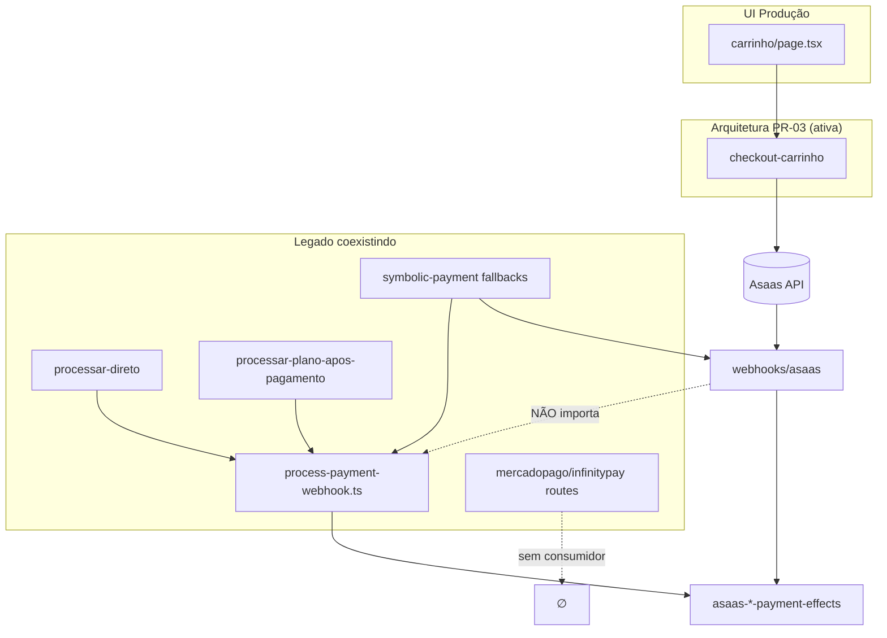

# QE-02a — Auditoria de Código Legado do Fluxo Financeiro

**Modo:** READ ONLY · **Branch:** `pr03-clean` @ `66a8e5c` · **Data:** 2026-07-10

## Objetivo

Identificar o que do fluxo financeiro antigo ainda coexist com a arquitetura PR-03 (webhook Asaas + libs de efeitos modulares).

---

## Resposta executiva

| Métrica | Valor |
|---------|-------|
| **Código financeiro legado ainda existente** | **~40%** do domínio (~3.400 de ~8.573 linhas em 54 arquivos) |
| Legado ainda executável | ~28% |
| Código morto removível agora | ~12% |
| Webhook de produção | Apenas `POST /api/webhooks/asaas` |
| Checkout de produção (UI) | Apenas `POST /api/asaas/checkout-carrinho` |

A arquitetura PR-03 **está ativa** para o fluxo real (carrinho → Asaas → webhook → efeitos), mas **convive** com um orquestrador paralelo (`process-payment-webhook.ts`), providers abandonados (MP/Infinity), rotas admin/script sem UI, e fallbacks agressivos de metadata/simbólico.

---

## 1. `process-payment-webhook.ts`

```
process-payment-webhook.ts
        ↓ importam
├── pagamentos/processar-direto        (script PS1 + admin)
├── pagamentos/processar-plano-apos-pagamento  (sucesso plano, minha-conta)
└── debug/processar-ultimo-pagamento   (debug admin)
        ↓ NÃO é chamado por
└── webhooks/asaas/route.ts            (duplica lógica inline)
```

**Classificação:** Legado — necessário hoje apenas para fallbacks localhost/admin até consolidação no webhook.

---

## 2. `api/webhooks/asaas/route.ts`

| Pergunta | Resposta |
|----------|----------|
| É o único webhook ativo? | **Sim** — único que persiste `Payment` e dispara efeitos |
| Outros webhooks? | `webhooks/mercadopago` = stub (só log, sem Prisma) |
| Proxies internos? | `processar-manual`, `buscar-por-fatura`, `buscar-por-valor` fazem `fetch` para este endpoint |

**Classificação:** Necessário (canônico PR-03).

---

## 3. Pipeline checkout — uso real pela UI

| Rota | Consumidor UI | Status |
|------|---------------|--------|
| `POST /api/asaas/checkout-carrinho` | `carrinho/page.tsx` | **Necessário** — fluxo produção |
| `POST /api/asaas/checkout-agendamento` | Nenhum fetch direto | **Necessário** — API admin/simbólico |
| `POST /api/asaas/checkout` | Nenhum | **Legado** — plano inalcançável (ver abaixo) |
| `POST /api/mercadopago/*` | Nenhum | **Obsoleto** |
| `POST /api/infinitypay/*` | Nenhum | **Obsoleto** |
| `POST /api/pagamentos` (MP) | Nenhum | **Obsoleto** |

**Fluxo plano quebrado na UI:**

```
planos/page.tsx → /pagamentos?planId&modo
       ↓
pagamentos/page.tsx → router.replace("/carrinho")  // perde query params
       ↓
carrinho → checkout-carrinho (agendamento avulso, não plano)
```

`payment-provider` retorna **somente `asaas`**; carrinho monta `/api/${provider}/checkout-carrinho`, mas MP/Infinity **não têm** rota `checkout-carrinho`.

---

## 4. Código morto

| Arquivo | Evidência |
|---------|-----------|
| `api/agendamento-checkout/route.ts` | Cache memória; zero imports/fetch no `src/` |
| `api/carrinho-checkout/route.ts` | Idem |
| `api/pagamentos/route.ts` | MP legado; zero consumidor UI |
| `api/webhooks/mercadopago/route.ts` | Stub com TODO comentado |
| Rotas MP/Infinity checkout | Existência sem chamadas |

---

## 5. Código inalcançável

- `POST /api/asaas/checkout` — implementado, sem fetch na UI
- `POST /api/test-payment` com `tipo=agendamento|plano` — retorna **410 Gone**
- Fluxo `planos → pagamentos → carrinho` — redirect descarta parâmetros do plano

---

## 6. Fallbacks legados (TESTE_, R$5, metadata)

| Local | Padrão | Ainda usado? |
|-------|--------|--------------|
| `symbolic-payment.ts` | `TESTE_`, `SYMBOLIC_*_BRL = 5`, `amount === 5` | Sim — admin QA, cupons teste |
| `asaas-agendamento-reconcile.ts` | 5 níveis de `findFirst` até "qualquer metadata do userId" | Sim — webhook + orquestrador legado |
| `meus-dados/route.ts` | Auto-vincula cupons `TESTE_AGEND_*` por pagamento R$5 | Sim |
| `plan-payment-simulation.ts` | Duplica regras simbólicas de plano | Sim — efeitos plano |

**Risco:** metadata errado pode ser associado a pagamento quando `asaasId` não bate.

---

## 7. Endpoints legados sem consumidores UI

| Endpoint | Consumidores reais |
|----------|-------------------|
| `processar-direto` | `processar_pagamento.ps1`, docs |
| `processar-manual` | Docs; admin manual |
| `buscar-por-fatura` | Docs; admin manual |
| `buscar-por-valor` | Docs; admin manual |
| `pagamentos/debug` | Nenhum |
| `debug/processar-ultimo-pagamento` | Debug admin |
| `asaas/checkout` | Nenhum UI |
| `mercadopago/*`, `infinitypay/*` | Nenhum |

---

## 8. Provider legado Mercado Pago / Infinity

| Provider | Rotas | `payment-provider` | Ativo? |
|----------|-------|-------------------|--------|
| **Asaas** | checkout, checkout-carrinho, checkout-agendamento, webhook | `provider: "asaas"` | **Sim** |
| Mercado Pago | checkout, checkout-agendamento, pagamentos/route, webhook stub | Não exposto | **Não** |
| Infinity Pay | checkout, checkout-agendamento | Não exposto | **Não** |

Classes `MercadoPagoProvider` / `InfinityPayProvider` ainda existem em `payment-providers.ts`. Referências `mercadopagoId` persistem em queries do webhook e admin.

---

## Tabela de inventário

| Arquivo | Responsável | Consumidores | Status |
|---------|-------------|--------------|--------|
| `lib/process-payment-webhook.ts` | Orquestrador legado (espelho webhook) | processar-direto, processar-plano-apos-pagamento, debug | **Legado** |
| `api/webhooks/asaas/route.ts` | Webhook canônico PR-03 | Asaas; proxies admin | **Necessário** |
| `api/webhooks/mercadopago/route.ts` | Stub MP | Nenhum | **Obsoleto** |
| `api/asaas/checkout-carrinho/route.ts` | Checkout produção carrinho | carrinho/page.tsx | **Necessário** |
| `api/asaas/checkout-agendamento/route.ts` | Checkout agendamento/simbólico | API admin | **Necessário** |
| `api/asaas/checkout/route.ts` | Checkout plano | Nenhum UI | **Legado** |
| `api/mercadopago/checkout*.ts` | Checkout MP | Nenhum | **Obsoleto** |
| `api/infinitypay/checkout*.ts` | Checkout Infinity | Nenhum | **Obsoleto** |
| `api/pagamentos/route.ts` | Checkout MP legado | Nenhum | **Obsoleto** |
| `api/pagamentos/processar-direto/route.ts` | Manual → processPaymentWebhook | Script PS1 | **Legado** |
| `api/pagamentos/processar-manual/route.ts` | Admin → proxy webhook | Docs | **Legado** |
| `api/pagamentos/buscar-por-*.ts` | Admin → proxy webhook | Docs | **Legado** |
| `api/pagamentos/processar-plano-apos-pagamento/route.ts` | Fallback plano localhost | sucesso, minha-conta | **Legado** |
| `api/pagamentos/verificar/route.ts` | Status pagamento | sucesso, verificar | **Necessário** |
| `api/pagamentos/debug/route.ts` | Debug | Nenhum | **Obsoleto** |
| `api/agendamento-checkout/route.ts` | Cache abandonado | Nenhum | **Pode remover agora** |
| `api/carrinho-checkout/route.ts` | Cache abandonado | Nenhum | **Pode remover agora** |
| `api/payment-provider/route.ts` | Expõe provider ativo | carrinho | **Necessário** |
| `lib/payment-providers.ts` | Providers (Asaas + legado) | checkouts | **Legado** (Asaas necessário) |
| `lib/asaas-*-payment-effects.ts` | Efeitos PR-03 | webhook + orquestrador | **Necessário** |
| `lib/asaas-agendamento-reconcile.ts` | Metadata + reconcile | webhook + orquestrador | **Necessário** (fallbacks legado) |
| `lib/symbolic-payment.ts` | TESTE_/R$5/simbólico | admin, meus-dados | **Legado** |
| `api/test-payment/route.ts` | Checkout teste admin | agendamento/planos (410) | **Legado** |
| `api/admin/reprocessar-pagamento-*-teste/route.ts` | Simulação sem Asaas | admin UI | **Legado** |
| `pagamentos/page.tsx` | Redirect /carrinho | planos (quebra fluxo) | **Legado** |
| `pagamentos/sucesso/page.tsx` | Pós-checkout | backUrls Asaas | **Necessário** |

---

## Plano de remoção sugerido

### Pode remover agora (~12%)
- `agendamento-checkout`, `carrinho-checkout`
- `webhooks/mercadopago`, `pagamentos/route` (MP)
- Rotas `mercadopago/*`, `infinitypay/*`
- `pagamentos/debug`

### Pode remover após deploy (~28% legado executável)
- Unificar `process-payment-webhook` no webhook → remover orquestrador duplicado
- Rotas admin/script (`processar-direto`, `processar-manual`, `buscar-por-*`)
- Classes MP/Infinity em `payment-providers.ts`
- Fallback `amount === 5` e cascata agressiva de metadata (após garantir `asaasId` em todos checkouts)

### Não remover sem substituir
- `webhooks/asaas`, `checkout-carrinho`, libs de efeitos PR-03
- `processar-plano-apos-pagamento` (até webhook estável em prod)
- `symbolic-payment` (QA admin ainda depende)

---

## Diagrama de coexistência



---

## Veredito

**Coexistência legado + PR-03: CONFIRMADA.**

Estimativa: **~40%** do código financeiro ainda é legado ou obsoleto. O núcleo PR-03 (~60%) já opera o fluxo real de agendamento avulso; o restante são duplicações, providers mortos, rotas admin, e fallbacks de simulação/metadata herdados de iterações anteriores.
