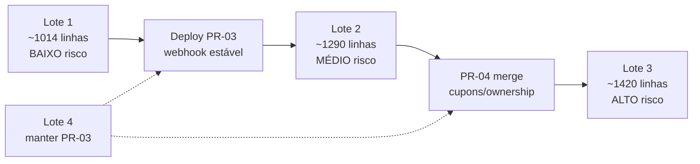

# QE-02b — Plano de Remoção do Legado Financeiro

**Modo:** READ ONLY · **Branch:** `pr03-clean` @ `66a8e5c` · **Base:** [QE-02a](qe02a-legacy-financial.md)

## Resposta executiva

| Métrica | Valor |
|---------|-------|
| **Linhas removíveis após estabilização completa** | **~3.904** (~46% do domínio financeiro) |
| Lote 1 (seguro, agora) | ~1.014 linhas |
| Lote 2 (pós-deploy) | ~1.290 linhas |
| Lote 3 (pós PR-04) | ~1.420 linhas |
| Edits parciais (metadata, mercadopagoId) | ~180 linhas |

**PR-04** = Cupons e ownership (`simulation-coupon*`, `coupon-origin`, `coupon-refund`, repair scripts).

---

## Organização em lotes

### Lote 1 — Remoção segura (~1.014 linhas)

Código morto/obsoleto sem importadores nem executores produtivos.

| Commit sugerido | Arquivos |
|-----------------|----------|
| `chore(payments): remove dead MP/Infinity routes and checkout caches` | 9 rotas abaixo |
| `chore(deps): remove mercadopago package` | `package.json`, lockfile |

**Arquivos:**
- `api/agendamento-checkout/route.ts`
- `api/carrinho-checkout/route.ts`
- `api/webhooks/mercadopago/route.ts`
- `api/pagamentos/route.ts`
- `api/mercadopago/checkout/route.ts`
- `api/mercadopago/checkout-agendamento/route.ts`
- `api/infinitypay/checkout/route.ts`
- `api/infinitypay/checkout-agendamento/route.ts`
- `api/pagamentos/debug/route.ts`

**Edit adjacente:** `carrinho/page.tsx` — fixar `paymentProvider` como `"asaas"` apenas.

---

### Lote 2 — Remoção pós-deploy (~1.290 linhas)

**Pré-requisitos:**
1. Webhook Asaas estável em produção (≥7 dias, zero órfãos)
2. Extrair handler compartilhado do webhook **ou** eliminar fallbacks localhost
3. Atualizar docs (`PRE_LANCAMENTO_CHECKLIST.md`, `processar_pagamento.ps1`)

| Commit sugerido | Arquivos |
|-----------------|----------|
| `refactor(payments): remove legacy orchestrator and manual routes` | `process-payment-webhook.ts`, `processar-direto`, `processar-manual`, `buscar-por-*`, `debug/processar-ultimo-pagamento`, `processar_pagamento.ps1` |
| `refactor(payments): remove plan localhost fallback` | `processar-plano-apos-pagamento` + edits `sucesso/page.tsx`, `minha-conta/page.tsx` |
| `refactor(payments): strip Infinity/MP from payment-providers` | `payment-providers.ts`, `test-payment/route.ts` |
| `refactor(payments): drop mercadopagoId from queries` | `webhooks/asaas`, `verificar`, `admin/pagamentos` (edit parcial) |

---

### Lote 3 — Remoção pós PR-04 (~1.420 linhas)

**Pré-requisitos:**
1. PR-04 mergeado (ownership + `simulation-coupon*`)
2. Fluxo plano UI reconectado (`planos` → `asaas/checkout`)
3. Admin QA migrado das rotas `reprocessar-pagamento-*`
4. Metadata sempre com `asaasId` em checkouts

| Commit sugerido | Arquivos |
|-----------------|----------|
| `feat(plans): wire plan checkout UI` | `planos/page.tsx`, `pagamentos/page.tsx`, `asaas/checkout` |
| `refactor(payments): replace symbolic-payment with PR-04 libs` | `symbolic-payment.ts`, `symbolic-payment-resolve.ts`, `plan-payment-simulation.ts`, `payment-simulation-coupon-gate.ts`, `test-payment`, `reprocessar-pagamento-*` |
| `refactor(payments): remove vincular-cupons-teste shim` | `meus-dados/vincular-cupons-teste`, `minha-conta/page.tsx`, trechos `meus-dados/route.ts` |
| `refactor(payments): tighten metadata fallbacks` | `asaas-agendamento-reconcile.ts` (parcial, ~45 linhas) |

---

### Lote 4 — Manter

Núcleo PR-03 — **não remover**:

- `webhooks/asaas/route.ts`
- `asaas/checkout-carrinho`, `asaas/checkout-agendamento`
- `asaas-*-payment-effects.ts`, `asaas-agendamento-reconcile.ts` (core)
- `payment-providers.ts` (AsaasProvider)
- `payment-provider/route.ts`, `pagamentos/verificar`
- Páginas `pagamentos/sucesso|verificar|falha|pendente`
- `agendamento-payment-rules.ts`, `agendamento-payment-coupons.ts`, `plan-prices.ts`

---

## Análise item a item

Legenda: ✅ Sim · ❌ Não · ⚠️ Parcial

### Código morto

#### `api/agendamento-checkout/route.ts` (39 linhas)

| # | Resposta |
|---|----------|
| 1. Quem importa? | Ninguém |
| 2. Quem executa? | Ninguém |
| 3. Remover agora? | ✅ Sim |
| 4. Esperar deploy? | ❌ Não |
| 5. Esperar PR-04? | ❌ Não |
| 6. Risco | **BAIXO** |
| 7. Dependências indiretas | Cache `Map` isolado |
| 8. Mesmo commit | `carrinho-checkout/route.ts` |

#### `api/carrinho-checkout/route.ts` (40 linhas)

| # | Resposta |
|---|----------|
| 1–5 | Igual ao anterior |
| 6. Risco | **BAIXO** |
| 8. Mesmo commit | `agendamento-checkout/route.ts` |

---

### Obsoleto

#### `api/webhooks/mercadopago/route.ts` (35 linhas)

| # | Resposta |
|---|----------|
| 1. Quem importa? | Ninguém no `src/` |
| 2. Quem executa? | MP externo (se URL legada no painel — improvável) |
| 3. Remover agora? | ✅ Sim |
| 4–5 | ❌ Não |
| 6. Risco | **BAIXO** |
| 7. Dependências | Relatórios guardian apenas |
| 8. Mesmo commit | Todas rotas MP + `pagamentos/route.ts` |

#### `api/pagamentos/route.ts` (134 linhas) — MP Preference

| # | Resposta |
|---|----------|
| 1–2 | Zero consumidores |
| 3–5 | ✅ Remover agora |
| 6. Risco | **BAIXO** |
| 7. Dependências | `import mercadopago` → remover dep `package.json` |
| 8. Mesmo commit | Rotas `mercadopago/*` |

#### `api/mercadopago/checkout/route.ts` (190 linhas)

| # | Resposta |
|---|----------|
| 1–2 | Zero consumidores |
| 3–5 | ✅ Remover agora |
| 6. Risco | **BAIXO** |
| 8. Mesmo commit | `checkout-agendamento`, `pagamentos/route`, webhook MP |

#### `api/mercadopago/checkout-agendamento/route.ts` (271 linhas)

| # | Resposta |
|---|----------|
| 1–2 | Zero consumidores; sem `PaymentMetadata` |
| 3–5 | ✅ Remover agora |
| 6. Risco | **BAIXO** |
| 8. Mesmo commit | Demais rotas MP Lote 1 |

#### `api/infinitypay/checkout/route.ts` (108 linhas)

| # | Resposta |
|---|----------|
| 1–2 | Zero consumidores |
| 3–5 | ✅ Remover agora |
| 6. Risco | **BAIXO** |
| 7. Dependências | `InfinityPayProvider` removido no Lote 2 |
| 8. Mesmo commit | `infinitypay/checkout-agendamento` |

#### `api/infinitypay/checkout-agendamento/route.ts` (175 linhas)

| # | Resposta |
|---|----------|
| 1–5 | Igual Infinity checkout plano |
| 6. Risco | **BAIXO** |

#### `api/pagamentos/debug/route.ts` (22 linhas)

| # | Resposta |
|---|----------|
| 1–2 | Zero consumidores |
| 3–5 | ✅ Remover agora |
| 6. Risco | **BAIXO** |

#### `package.json` — dependência `mercadopago`

| # | Resposta |
|---|----------|
| 3. Remover agora? | ✅ Após Lote 1 rotas |
| 6. Risco | **BAIXO** (validar `tsc`/`build`) |
| 8. Mesmo commit | Lote 1 rotas MP |

---

### Legado

#### `lib/process-payment-webhook.ts` (168 linhas)

| # | Resposta |
|---|----------|
| 1. Quem importa? | `processar-direto`, `processar-plano-apos-pagamento`, `debug/processar-ultimo-pagamento` |
| 2. Quem executa? | POST nessas 3 rotas |
| 3. Remover agora? | ❌ Não |
| 4. Esperar deploy? | ✅ Sim |
| 5. Esperar PR-04? | ❌ Não |
| 6. Risco | **ALTO** — diverge do webhook; carrinho incompleto no orquestrador |
| 7. Dependências | Guardian scripts; fallbacks localhost |
| 8. Mesmo commit | `processar-direto`, `debug/processar-ultimo-pagamento`, `processar_pagamento.ps1` |

**Ação prévia:** extrair `handleAsaasPaymentReceived()` compartilhado com `webhooks/asaas`.

#### `api/pagamentos/processar-direto/route.ts` (272 linhas)

| # | Resposta |
|---|----------|
| 1. Importa | `process-payment-webhook` (dynamic) |
| 2. Executa | `processar_pagamento.ps1`, admin manual |
| 3–5 | ❌ Agora · ✅ Deploy · ❌ PR-04 |
| 6. Risco | **MÉDIO** |
| 8. Mesmo commit | `process-payment-webhook.ts`, PS1 |

#### `api/pagamentos/processar-manual/route.ts` (168 linhas)

| # | Resposta |
|---|----------|
| 1. Importa | Nenhum módulo legado — faz `fetch` ao webhook |
| 2. Executa | Admin manual (docs) |
| 3–5 | ❌ Agora · ✅ Deploy · ❌ PR-04 |
| 6. Risco | **MÉDIO** — útil em incidentes |
| 8. Mesmo commit | `buscar-por-fatura`, `buscar-por-valor` |

#### `api/pagamentos/buscar-por-fatura/route.ts` (178 linhas)

| # | Resposta |
|---|----------|
| 2. Executa | Admin → proxy `webhooks/asaas` |
| 3–5 | ❌ · ✅ · ❌ |
| 6. Risco | **MÉDIO** |
| 8. Mesmo commit | `processar-manual`, `buscar-por-valor` |

#### `api/pagamentos/buscar-por-valor/route.ts` (155 linhas)

| # | Resposta |
|---|----------|
| Idem buscar-por-fatura | |
| 6. Risco | **MÉDIO** |

#### `api/pagamentos/processar-plano-apos-pagamento/route.ts` (102 linhas)

| # | Resposta |
|---|----------|
| 1. Importa | `process-payment-webhook` |
| 2. Executa | `pagamentos/sucesso?tipo=plano`, `minha-conta/page.tsx` |
| 3. Remover agora? | ❌ Não |
| 4. Esperar deploy? | ✅ Sim |
| 5. Esperar PR-04? | ❌ Não |
| 6. Risco | **ALTO** — compensa webhook ausente em localhost |
| 8. Mesmo commit | Edits em `sucesso/page.tsx`, `minha-conta/page.tsx` |

#### `api/debug/processar-ultimo-pagamento/route.ts` (156 linhas)

| # | Resposta |
|---|----------|
| 1. Importa | `process-payment-webhook` |
| 3–5 | ❌ · ✅ · ❌ |
| 6. Risco | **MÉDIO** |
| 8. Mesmo commit | `process-payment-webhook.ts` |

#### `api/asaas/checkout/route.ts` (184 linhas) — plano

| # | Resposta |
|---|----------|
| 1–2 | Zero fetch UI; rota existe mas inalcançável |
| 3. Remover agora? | ❌ Não |
| 4. Esperar deploy? | ❌ Não |
| 5. Esperar PR-04? | ✅ Sim (fluxo plano + ownership) |
| 6. Risco | **ALTO** — única implementação checkout plano Asaas |
| 7. Dependências | `PLAN_PRICES`, `checkout-active-plan-gate` |
| 8. Mesmo commit | `planos/page.tsx`, `pagamentos/page.tsx` |

#### `pagamentos/page.tsx` (16 linhas) — redirect cego

| # | Resposta |
|---|----------|
| 2. Executa | `planos/page.tsx` → perde `planId`/`modo` |
| 3–5 | ❌ · ❌ · ✅ PR-04 |
| 6. Risco | **ALTO** |
| 8. Mesmo commit | `planos/page.tsx`, `asaas/checkout` |

#### `payment-providers.ts` — InfinityPay + MercadoPago (~91 linhas)

| # | Resposta |
|---|----------|
| 1. Importa | `test-payment` (Infinity fallback) |
| 2. Executa | `test-payment` se sem `ASAAS_API_KEY` |
| 3–5 | ❌ · ✅ · ❌ |
| 6. Risco | **BAIXO** |
| 8. Mesmo commit | `test-payment/route.ts` (remover branch Infinity) |

#### `api/test-payment/route.ts` (219 linhas)

| # | Resposta |
|---|----------|
| 2. Executa | `agendamento/page.tsx`, `planos/page.tsx` → **410** para agendamento/plano |
| 3–5 | ❌ · ❌ · ✅ PR-04 |
| 6. Risco | **MÉDIO** |
| 8. Mesmo commit | `reprocessar-pagamento-*`, edits UI admin |

#### `api/admin/reprocessar-pagamento-teste/route.ts` (225 linhas)

| # | Resposta |
|---|----------|
| 2. Executa | `admin/page`, `admin/agendamentos`, `admin/pagamentos`, `agendamento/page` |
| 3–5 | ❌ · ❌ · ✅ PR-04 |
| 6. Risco | **ALTO** — QA admin depende hoje |
| 7. Dependências | `symbolic-payment`, `symbolic-payment-resolve` |
| 8. Mesmo commit | Libs simbólicas + admin UI |

#### `api/admin/reprocessar-pagamento-plano-teste/route.ts` (156 linhas)

| # | Resposta |
|---|----------|
| 2. Executa | `admin/pagamentos/page.tsx` |
| 3–5 | ❌ · ❌ · ✅ PR-04 |
| 6. Risco | **ALTO** |

#### `lib/symbolic-payment.ts` (185 linhas)

| # | Resposta |
|---|----------|
| 1. Importa | webhook, checkout-agendamento, efeitos plano, cupons, admin, refunds (9+ arquivos) |
| 2. Executa | Todo fluxo simbólico TESTE_/R$5 |
| 3–5 | ❌ · ❌ · ✅ PR-04 |
| 6. Risco | **ALTO** |
| 7. Dependências | PR-04 `simulation-coupon*` substitui |
| 8. Mesmo commit | `symbolic-payment-resolve`, `plan-payment-simulation`, `payment-simulation-coupon-gate` |

**Estratégia:** fase 1 = remover fallback `amount===5`; fase 2 = substituir lib inteira.

#### `lib/symbolic-payment-resolve.ts` (233 linhas)

| # | Resposta |
|---|----------|
| 1. Importa | `reprocessar-pagamento-*` apenas |
| 3–5 | ❌ · ❌ · ✅ PR-04 |
| 6. Risco | **ALTO** |

#### `lib/plan-payment-simulation.ts` (25 linhas)

| # | Resposta |
|---|----------|
| 1. Importa | `asaas-plano-payment-effects.ts` |
| 3–5 | ❌ · ❌ · ✅ PR-04 |
| 6. Risco | **MÉDIO** — duplica `SYMBOLIC_PLANO_BRL` |

#### `lib/payment-simulation-coupon-gate.ts` (27 linhas)

| # | Resposta |
|---|----------|
| 1. Importa | `admin-delete-payment.ts` |
| 3–5 | ❌ · ❌ · ✅ PR-04 |
| 6. Risco | **MÉDIO** |

#### `asaas-agendamento-reconcile.ts` — fallbacks metadata (~45 linhas)

| # | Resposta |
|---|----------|
| 1. Importa | `webhooks/asaas`, `process-payment-webhook` |
| 2. Executa | Todo `PAYMENT_RECEIVED` |
| 3. Remover agora? | ❌ Não |
| 4. Esperar deploy? | ✅ Sim |
| 5. Esperar PR-04? | ❌ Não (mas ideal após Lote 2) |
| 6. Risco | **ALTO** — pagamentos antigos sem `asaasId` |
| 8. Mesmo commit | Isolado (edit parcial, manter reconcile core) |

#### `api/meus-dados/vincular-cupons-teste/route.ts` (113 linhas)

| # | Resposta |
|---|----------|
| 2. Executa | `minha-conta/page.tsx` |
| 3–5 | ❌ · ❌ · ✅ PR-04 |
| 6. Risco | **MÉDIO** |
| 8. Mesmo commit | `minha-conta/page.tsx`, trechos `meus-dados/route.ts` |

#### `mercadopagoId` em queries (~12 linhas, edit)

| # | Resposta |
|---|----------|
| Arquivos | `webhooks/asaas`, `verificar`, `admin/pagamentos` |
| 3–5 | ❌ · ✅ · ❌ |
| 6. Risco | **MÉDIO** — migração Prisma separada |
| 8. Mesmo commit | Lote 2 após auditoria DB |

#### `processar_pagamento.ps1` (21 linhas)

| # | Resposta |
|---|----------|
| 2. Executa | Chama `processar-direto` |
| 3–5 | ❌ · ✅ · ❌ |
| 6. Risco | **BAIXO** |
| 8. Mesmo commit | `processar-direto/route.ts` |

---

## Ordem de execução recomendada

```
1. Lote 1 (agora)           → build + tsc
2. Deploy PR-03 RC            → monitor webhook 7d
3. Lote 2 (pós-deploy)      → unificar orchestrator
4. Merge PR-04              → cupons/ownership
5. Lote 3 (pós PR-04)       → plano UI + simulação
6. Opcional                   → migração drop mercadopagoId
```

---

## Diagrama de dependências entre lotes



---

## Veredito

| Pergunta | Resposta |
|----------|----------|
| Linhas removíveis após estabilização? | **~3.904** |
| % do domínio financeiro? | **~46%** |
| Primeiro passo seguro? | **Lote 1** — 9 rotas + dep `mercadopago` npm |
| Maior risco? | Remover `symbolic-payment` ou `process-payment-webhook` antes dos pré-requisitos |

Nenhum código foi alterado. Plano encerrado conforme solicitado.
