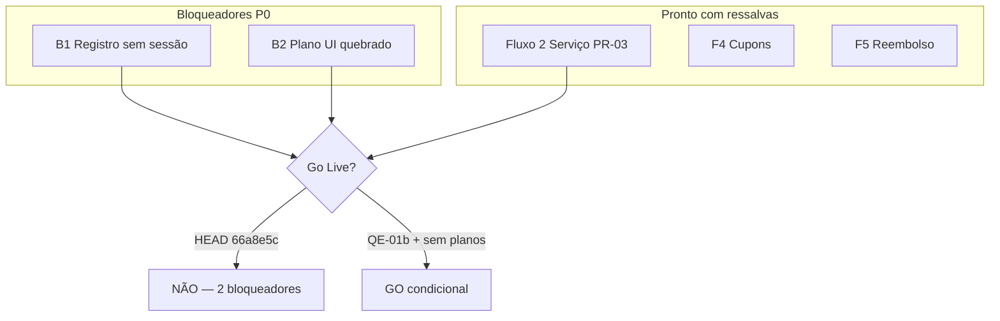

# QE-03 — Gate Funcional para Lançamento

**Modo:** READ ONLY · **Branch:** `pr03-clean` @ `66a8e5c` · **Escopo:** núcleo PR-03

## Veredito final

| | |
|---|---|
| **Go Live pronto?** | **NÃO** |
| **Bloqueadores reais (HEAD commitado)** | **2** |
| **Com QE-01b commitado + planos fora do escopo** | **0 bloqueadores de código** (condicional) |

---

## Contexto de deploy

| Estado | Detalhe |
|--------|---------|
| **HEAD `66a8e5c`** | RC PR-03 fechada; registro **sem** auto-login |
| **Working tree (não commitado)** | QE-01b: `createUserSession` em registro — **corrige Fluxo 1** se incluído no deploy |

A avaliação primária abaixo refere-se ao que **seria deployado hoje** (`66a8e5c`), com notas de mitigação quando aplicável.

---

## Tabela resumo

| Fluxo | Status | Bloqueia Deploy? | Prioridade |
|-------|--------|------------------|------------|
| 1 — Registro → Login → Minha Conta | 🔴 REPROVADO | **SIM** | P0 |
| 2 — Compra de Serviço | 🟡 ATENÇÃO | NÃO | P1 |
| 3 — Compra de Plano | 🔴 REPROVADO | **SIM*** | P0 |
| 4 — Uso de Cupom | 🟡 ATENÇÃO | NÃO | P2 |
| 5 — Reembolso | 🟡 ATENÇÃO | NÃO | P2 |
| 6 — Administração | 🟡 ATENÇÃO | NÃO | P2 |
| 7 — Segurança | 🟡 ATENÇÃO | NÃO | P1 |
| 8 — Persistência | 🟡 ATENÇÃO | NÃO | P1 |

\* Bloqueia deploy **somente se** venda de planos estiver no escopo do lançamento.

---

## Fluxo 1 — Registro → Login → Minha Conta

**Status: 🔴 REPROVADO**

| # | Pergunta | Resposta |
|---|----------|----------|
| 1 | O fluxo existe? | Sim — páginas e APIs presentes |
| 2 | Está completo? | **Não** — registro não autentica no HEAD |
| 3 | Código legado interfere? | Não |
| 4 | Perda financeira? | Não |
| 5 | Perda de dados? | Não |
| 6 | Vazamento de dados? | Não |
| 7 | Bloqueia produção? | **SIM** |

**Evidência (HEAD):**
```
registro → POST /api/registro (cria User, SEM Session/cookie)
        → router.push("/conta")
        → /conta detecta user=null → /login
        → usuário precisa logar manualmente (fricção; parece bug)
```

**Mitigação WIP:** QE-01b adiciona `createUserSession(user.id)` — build passa; **não commitado**.

**Login → Minha Conta:** 🟢 OK após autenticação (`requireAuth` + filtros `userId`).

---

## Fluxo 2 — Compra de Serviço

**Status: 🟡 ATENÇÃO**

| # | Pergunta | Resposta |
|---|----------|----------|
| 1 | O fluxo existe? | **Sim** — caminho produção PR-03 |
| 2 | Está completo? | **Sim** para agendamento avulso pago |
| 3 | Código legado interfere? | **Sim** — metadata fallback, orquestrador duplicado (não no caminho feliz) |
| 4 | Perda financeira? | **Pode** — metadata errado → efeitos no agendamento errado |
| 5 | Perda de dados? | **Pode** — appointment/cupom associados incorretamente |
| 6 | Vazamento de dados? | Não |
| 7 | Bloqueia produção? | **NÃO** (com Asaas configurado + monitoramento) |

**Caminho produção:**
```
agendamento/page.tsx → sessionStorage carrinho
  → carrinho/page.tsx → POST /api/asaas/checkout-carrinho
  → Asaas checkout → POST /api/webhooks/asaas
  → processCarrinhoPaymentEffects → Appointment + Coupon
  → minha-conta (GET /api/meus-dados)
```

**Pontos fortes PR-03:**
- `PaymentMetadata` criado antes do POST Asaas
- Idempotência `Payment.asaasId`
- Efeitos modulares (`asaas-carrinho-payment-effects`)
- Cupom 100% via `/api/agendamentos/com-cupom` (sem Payment)

**Riscos residuais:**
- `loadMetadataForPayment` — 5 níveis de fallback até "qualquer metadata do userId"
- Webhook sempre HTTP 200 — falhas silenciosas
- Pré-requisitos operacionais: `ASAAS_API_KEY`, webhook URL, `ASAAS_WEBHOOK_ACCESS_TOKEN`, `NEXT_PUBLIC_SITE_URL`

---

## Fluxo 3 — Compra de Plano

**Status: 🔴 REPROVADO**

| # | Pergunta | Resposta |
|---|----------|----------|
| 1 | O fluxo existe? | **Não na UI** — API existe, consumidor ausente |
| 2 | Está completo? | **Não** |
| 3 | Código legado interfere? | **Sim** — redirect `/pagamentos` → `/carrinho` descarta params |
| 4 | Perda financeira? | Não (fluxo não executável) |
| 5 | Perda de dados? | Não |
| 6 | Vazamento de dados? | Não |
| 7 | Bloqueia produção? | **SIM** se planos no escopo |

**Fluxo quebrado:**
```
planos/page.tsx → /pagamentos?planId=X&modo=mensal
pagamentos/page.tsx → router.replace("/carrinho")  // perde planId
carrinho → checkout-carrinho (agendamento, não plano)
```

**API órfã:** `POST /api/asaas/checkout` (plano mensal/anual) — implementada, zero fetch na UI.

**Fallback legado:** `processar-plano-apos-pagamento` — só compensa webhook ausente em localhost.

---

## Fluxo 4 — Uso de Cupom

**Status: 🟡 ATENÇÃO**

| # | Pergunta | Resposta |
|---|----------|----------|
| 1 | O fluxo existe? | Sim |
| 2 | Está completo? | Sim para validação e aplicação |
| 3 | Código legado interfere? | **Sim** — `TESTE_`, R$5, `vincular-cupons-teste` |
| 4 | Perda financeira? | Não direta |
| 5 | Perda de dados? | Não |
| 6 | Vazamento de dados? | Não |
| 7 | Bloqueia produção? | **NÃO** |

**Caminhos:**
- Validação: `POST /api/coupons/validate` + `validate-coupon-checkout.ts`
- Cupom 100%: `POST /api/agendamentos/com-cupom`
- Pós-pagamento: `agendamento-payment-coupons.ts` (idempotente por `paymentId`)

**Gap:** ownership/refund sync incompleto até **PR-04**.

---

## Fluxo 5 — Reembolso

**Status: 🟡 ATENÇÃO**

| # | Pergunta | Resposta |
|---|----------|----------|
| 1 | O fluxo existe? | Sim — múltiplos caminhos |
| 2 | Está completo? | Sim com ressalvas |
| 3 | Código legado interfere? | **Sim** — heurísticas em `escolher-reembolso`, `appointment-refund-payment` |
| 4 | Perda financeira? | **Pode** — reembolso duplicado ou valor errado em edge cases |
| 5 | Perda de dados? | Não |
| 6 | Vazamento de dados? | Não |
| 7 | Bloqueia produção? | **NÃO** |

**Caminhos:**
| Tipo | Rota |
|------|------|
| Cancelamento admin | Usuário escolhe em `POST /api/agendamentos/escolher-reembolso` |
| Cancelamento usuário | `POST /api/agendamentos/cancelar` → `refundAsaasPayment` |
| Plano cancelado | `POST /api/planos/solicitar-reembolso` |
| Sync Asaas | Webhook `PAYMENT_REFUNDED` → `refundAsaasStatus` |

---

## Fluxo 6 — Administração

**Status: 🟡 ATENÇÃO**

| # | Pergunta | Resposta |
|---|----------|----------|
| 1 | O fluxo existe? | Sim |
| 2 | Está completo? | Sim para operações core |
| 3 | Código legado interfere? | **Sim** — `test-payment` 410, reprocessar-teste legado |
| 4 | Perda financeira? | Não |
| 5 | Perda de dados? | Não |
| 6 | Vazamento de dados? | Não |
| 7 | Bloqueia produção? | **NÃO** |

**Proteção:**
- UI: `admin/layout.tsx` — client-side `role === ADMIN` ou email hardcoded
- API: `requireAdmin()` server-side em `/api/admin/*`

**Gaps:** gate admin só no cliente para páginas; QA UI chama endpoints que retornam 410.

---

## Fluxo 7 — Segurança

**Status: 🟡 ATENÇÃO**

| # | Pergunta | Resposta |
|---|----------|----------|
| 1 | O fluxo existe? | Sim |
| 2 | Está completo? | Parcial |
| 3 | Código legado interfere? | Não |
| 4 | Perda financeira? | Não |
| 5 | Perda de dados? | Não |
| 6 | Vazamento de dados? | **Baixo risco** — isolamento por `userId` nas APIs |
| 7 | Bloqueia produção? | **NÃO** |

| Área | Avaliação |
|------|-----------|
| Sessão | Cookie `session_id` httpOnly, 7 dias, `secure` em prod |
| Isolamento usuários | `requireAuth()` + `where: { userId }` em dados sensíveis |
| Permissões admin | `requireAdmin()` server-side; email hardcoded como fallback |
| Middleware | Só manutenção — páginas usuário sem gate server-side |
| Webhook | Token opcional em dev; obrigatório recomendado em prod |

---

## Fluxo 8 — Persistência

**Status: 🟡 ATENÇÃO**

| # | Pergunta | Resposta |
|---|----------|----------|
| 1 | O fluxo existe? | Sim — modelos Prisma completos |
| 2 | Está completo? | Sim com ressalvas de idempotência |
| 3 | Código legado interfere? | **Sim** — metadata fallback, `mercadopagoId` |
| 4 | Perda financeira? | Não direta |
| 5 | Perda de dados? | **Pode** — reconcile sem re-run se 1ª execução falhou |
| 6 | Vazamento de dados? | Não |
| 7 | Bloqueia produção? | **NÃO** |

| Modelo | Estado PR-03 |
|--------|--------------|
| `Payment` | Criado no webhook; idempotência `asaasId` |
| `PaymentMetadata` | Criado no checkout; `asaasId` atualizado pós-Asaas |
| `Appointment` | Criado em `processCarrinhoPaymentEffects` |
| `Coupon` | Idempotente por `paymentId` (Serializable) |
| `UserPlan` | Via `processPlanoPaymentEffects` (fluxo plano UI quebrado) |

---

## Bloqueadores reais

### No deploy atual (`66a8e5c`): **2**

| ID | Bloqueador | Fluxo | Ação mínima |
|----|------------|-------|-------------|
| **B1** | Registro não cria sessão | 1 | Commitar QE-01b |
| **B2** | Compra de plano inacessível na UI | 3 | Reconectar `planos` → `asaas/checkout` **ou** desabilitar planos no lançamento |

### Cenários

| Cenário | Bloqueadores | Veredito |
|---------|--------------|----------|
| HEAD sem WIP, produto completo | 2 | **NÃO GO** |
| QE-01b commitado, só agendamento avulso | 0* | **GO condicional** |
| QE-01b + plano consertado | 0 | **GO condicional** |

\* Requer gates operacionais Asaas (webhook, keys, domínio) e smoke test E2E.

---

## Ações pré-Go Live (ordem)

1. **P0** — Commitar QE-01b (`createUserSession` no registro)
2. **P0** — Plano: consertar UI **ou** ocultar planos no lançamento
3. **P1** — Configurar webhook Asaas + monitoramento
4. **P1** — Smoke test: registro → carrinho → pagamento sandbox → minha-conta
5. **P2** — PR-04 antes de escalar cupons em produção

---

## Diagrama — estado do gate



---

Nenhum código foi alterado. Gate encerrado conforme solicitado.
